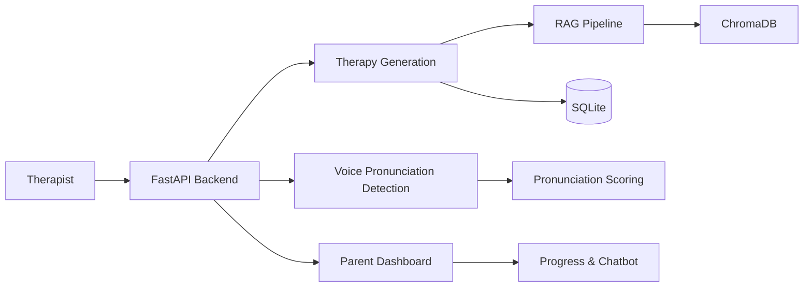

# Vocabuddy Backend

Backend API for the **Vocabuddy phonological therapy system**.  
This backend supports **phonological issue therapy for children** by generating therapy activities, validating AI-generated content, evaluating pronunciation attempts, tracking child progress, and providing AI-assisted insights for parents.

The backend is implemented using **FastAPI** and focuses only on **therapy intelligence and data processing**.  
User authentication and user management are intentionally excluded.

---

## Architecture

- **Framework**: FastAPI
- **API Type**: REST
- **AI Approach**: LLM-assisted generation with RAG
- **Vector Database**: Chroma DB (local persistent storage)
- **Relational Database**: SQLite
- **Embeddings**: Sentence Transformers
- **Voice Processing**: Algorithm-based pronunciation analysis (in progress)

### High-Level Architecture Diagram



## Project Structure

```
Vocabuddy-backend/
│
├── parentdashboard/
│   ├── api/                # Parent dashboard APIs
│   ├── ai/                 # LLM interaction logic
│   ├── rag/                # RAG pipeline (embeddings, retrieval)
│   ├── services/           # Business logic
│   ├── schemas/            # Request/response models
│   └── config.py
│
├── therapygeneration/
│   ├── api/                # Therapy generation APIs
│   ├── services/           # Therapy logic
│   ├── validators/         # Generated word validation
│   ├── llm/                # LLM-based generation
│   ├── repository/         # Data access layer
│   └── tests/
│
├── voice_pronunciation_detection/
│   └── voice_detection_model/  # Pronunciation analysis algorithms
│
├── chroma_db/              # Vector database storage
├── data/                   # Local data storage
├── main.py                 # FastAPI entry point
├── requirements.txt
├── QUICKSTART.md
└── README.md

```
## Dependencies
Main dependencies used in this project:
```aiignore
fastapi==0.104.1
uvicorn[standard]==0.24.0
python-dotenv==1.0.0
chromadb==0.4.18
sentence-transformers>=2.7.0
huggingface_hub>=0.19.0
pydantic==2.5.0
python-multipart==0.0.6
numpy<2
requests
```
Additional Python packages may be installed during development as required.

## Installation & Setup

### 1. Prerequisites
- Python 3.10
- pip
- Virtual environment (recommended)

### 2. Clone the Repository

```bash
git clone <repository-url>
cd Vocabuddy-backend
```

### 3. Create Virtual Environment (Optional but Recommended)


   ```bash
   python -m venv .venv
source .venv/bin/activate    # Linux / macOS
.venv\Scripts\activate       # Windows

   ```
### 4. Install Dependencies

```bash
pip install -r requirements.txt
```

### 5. Environment Variables
Create a .env file in the root directory if required:
```bash
# Example
ENV=development

```
## Running the Backend
### Development Mode
The API will be available at:
- api
```http://localhost:8000/```
- Swagger UI
```http://localhost:8000/docs```
- ReDoc
```http://localhost:8000/redoc```
